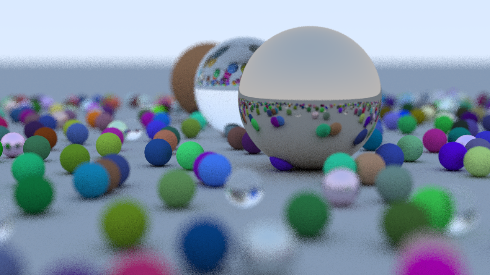

# vrai-tracer

_AKA:_ "true-tracer" (in French)

My attempt at following along with [Ray Tracing in One Weekend](https://github.com/RayTracing/raytracinginoneweekend) in Rust.

I plan to use this project as a testbed for implementing and profiling various 
programming paradigms and techniques in Rust. For example:
- Exploring dynamic dispatch vs. enum-based static dispatch with respect to
  performance, resource usage, and programming ergonomics.
- Various ways to multithread the raytracer.
- SIMD?



## Highlights

### Dynamic and Static dispatch... In one codebase?!

Thanks to Rust's powerful Trait system, robust generics, and rich macros,
this codebase can switch between Dynamic and Static dispatch by toggling a
single feature flag! Enabling the `enum_dispatch` feature switches the entire
project from Trait Object based dynamic dispatch, to enum based static dispatch!

And no, the codebase is _not_ a mess of `#[cfg(feature = "enum_dispatch")]`
declarations :smile:. The bulk of the conditionally compiled code lives in
`src/hittable/mod.rs` and `src/material/mod.rs`, while the rest of the codebase
uses types exported from those modules, unaware of the specific dispatch type.

### Live preview

I've opted to render directly onto a live framebuffer (courtesy of the great
`minifb` crate). This is neat, since it allows for cool things such as live
tweaking of render parameters, scene animation, and visualizing the render
progress by sending pixels to the buffer as they're completed. I'll be adding
static image output at some point as well.

#### With non-blocking rendering!

This is surprisingly tricky to get right in Rust, what with the borrow checker
not letting me just share a buffer between threads easily.

Check out `src/render/nonblocking.rs` for how I pulled it off.
_Spoiler alert: lots of channels!_ 

## Usage

```
cargo run --release [samples] [resolution]
```

Where resolution is of the form `WxH` (e.g: `640x480`)

I plan to parse CLI parameters properly at some point in the future :smile:.

Changing the scene requires modifying the code at the moment.
I hope to replace this with a serde based configuration format at some point.

## Controls

- Hit `Space` to start some basic camera movement.
- Hold `F` to freeze the current scene in place.
- `-` and `=` change the FOV.
- `W` and `S` move the camera in and away from the direction it's looking.
- `<` and `>` change the number of samples.
